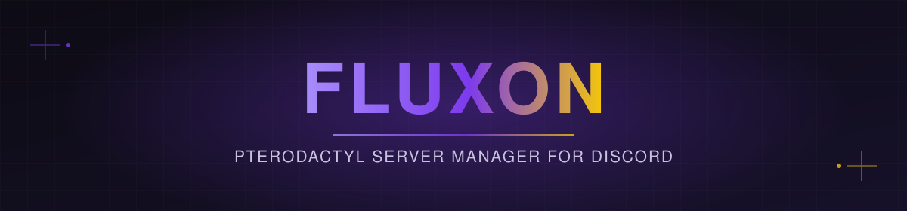
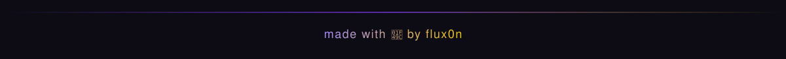

<div align="center">



<br/>

[](https://nodejs.org)
[](https://discord.js.org)
[](LICENSE)

**A Discord bot that turns Pterodactyl Panel management into a slash away.**
Free-tier servers, paid plans, boost perks, and full admin tooling — all from Discord.

</div>

<br/>

## ✨ Features

| | |
|---|---|
| 🖥️ **Server Lifecycle** | Users create, view, and manage their own Pterodactyl servers with `>server` |
| 💎 **Paid Plans** | Fixed-tier (`>paid`) or fully custom (`>plan`) paid servers, with automatic protection & expiry |
| 🚀 **Booster Perks** | Automatic resource perks for server boosters |
| 🔔 **Smart Logging** | Separate, color-coded log channels for free vs. paid server activity |
| 🧹 **Auto Cleanup** | Inactivity detection with grace periods and DM warnings before deletion |
| 🔑 **Role-Gated Access** | Fine-grained owner / role-based permissions for sensitive commands |
| 🌍 **Multi-language** | Built-in translation manager with several locales included |
| ⚙️ **Fully Configurable** | Every channel, role, and emoji ID lives in one `.env` file |

<br/>

## 🚀 Getting Started

**Requirements:** Node.js 18+, a Discord bot application, and a Pterodactyl Panel with API access.

```bash
# 1. Clone the repo
git clone https://github.com/your-username/fluxon.git
cd fluxon

# 2. Install dependencies
npm install

# 3. Configure your environment
cp .env.example config.env
# then fill in config.env with your bot token, panel URL/keys, and IDs

# 4. Run the bot
npm start
```

<br/>

## ⚙️ Configuration

All configuration lives in `config.env`. See [`.env.example`](.env.example) for the full list — grouped into:

- **Bot & Panel** — token, client ID, Pterodactyl API URL & keys
- **Channels** — logging, paid logs, expiry notices, cleanup notices, boost perks
- **Roles** — who gets paid perks, who can manage plans
- **Emojis** — status indicators used across embeds

No code edits needed for a fresh setup — just drop in your IDs and go.

<br/>

## 📋 Commands

| Command | Description |
|---|---|
| `>server` | Create and manage free-tier servers |
| `>plan` | Create custom-spec paid servers (owner / plan role only) |
| `>paid` | Apply a fixed paid tier to a server, new or existing |
| `>linkaccount` | Link a Discord user to a panel account |
| `>useonly` | Restrict bot usage to a specific channel |
| `>status` | Live node status embed |
| `>stats` | Bot & server statistics |
| `>user` | Look up a linked user's account |
| `>admin` / `>owner` | Administrative controls |
| `>help` | Full command reference |

<br/>

## 🛠️ Tech Stack

Built with [discord.js](https://discord.js.org), [Pterodactyl](https://pterodactyl.io)'s Application & Client APIs, and [quick.db](https://npmjs.com/package/quick.db) for lightweight persistence.

<br/>

<div align="center">

</div>
